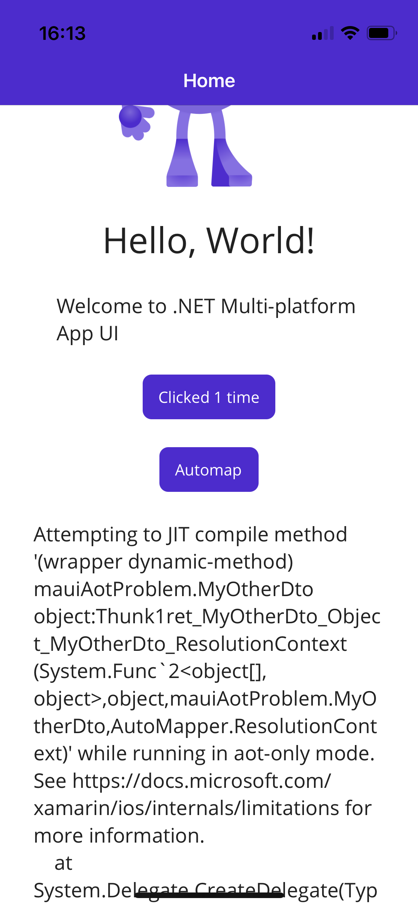
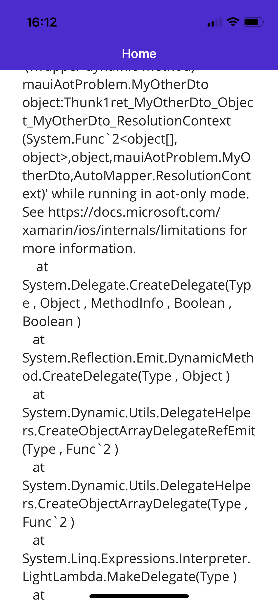
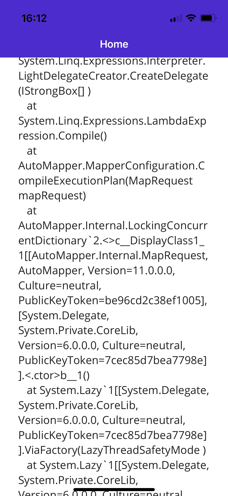
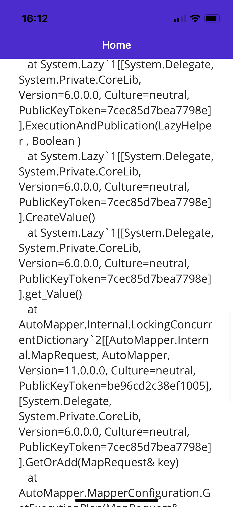
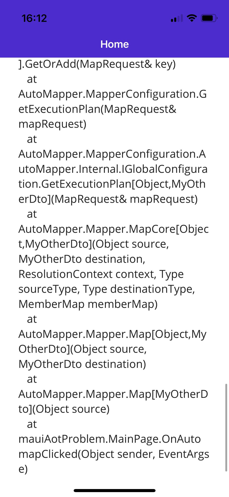

# mauiAotProblem

Show the System.ExecutionEngineException "Attempting to JIT compile method xxx while running in aot-only mode." on ios release mode.
The problem is seems to be with System.Linq.Expressions.LambdaExpression.Comile() which calls System.Linq.Expressions.Interpreter.LightDelegateCreator... and end in System.Reflection.Emit.DynamicMethod.CreateDelegate
Make sure to run it on a real device since the simulator does not have the same AOT compiler.

Run the application and press on the "Automap" button... you should see an exception in the label at the bottom.

Same or similar as https://github.com/xamarin/xamarin-macios/issues/12416

Screenshots of this app:

